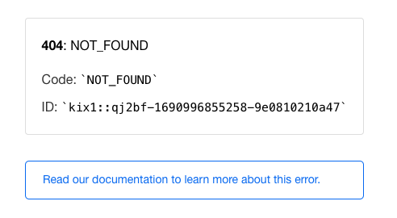
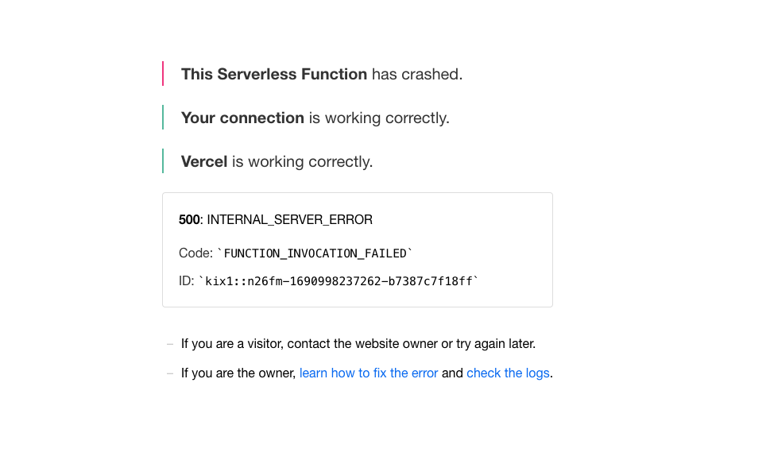

### vercel周りの設定

**vercel.json**
- `builds`
    - srcでserverless functionsで使いたいファイル，useでビルドするモジュールを指定する
    - https://vercel.com/docs/concepts/projects/project-configuration#builds

- `route`
    - 基本的にはsrcでパス，destでファイルを指定する
    - パスには正規表現が使える
    - https://vercel.com/docs/concepts/projects/project-configuration#routes

- `rewrites`
    - `route`はlegacyらしい
    - 代わりに使う

**not found**
- ルーティングが上手く行かないとnot foundになる
- ひとまずroute -> rewritesに変更 -> goは上手く行ったがpythonは上手く行かない


- ルーティングを直接指定してみる -> ルーティングは上手く行ったっぽいがクラッシュした
```
    // 変更前 { "source": "/python", "destination": "/app/python"}
    { "source": "/python", "destination": "/app/python/main.py"}
```
